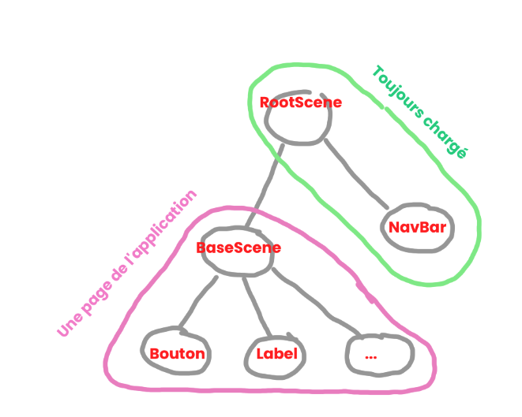

# Structure du projet

## 1 / Routage et hiérarchie JavaFX

### Élèments :


- Le **Routeur** est une classe statique (Pas d'instance, toutes les méthodes sont `static`) permettant de changer la page (ou scène actuellement affichée à l'écran).

- Un **Stage** JavaFX est tout simplement la fenêtre de l'application, soit ce qui contient les boutons réduire / plein écran / fermer et la racine de la hiérarchie (RootScene)

- La classe **RootScene** est une scène javaFX contenant
  
  - La Barre de navigation
  
  - La page courante (Scène JFX) qui est du type **IScene** (Interface)
  
  - **RootScene n'est jamais déchargée** (Il y a une unique instance dans le projet)

- Les classe de type **IScene** sont des pages de l'application, ces dernières sont chargées / déchargées par RootScene.
  
  - Une page doit est donc une classe java implémentant l'interface IScene et avec un extends sur un composant JavaFX (Le plus adapté pour la page)

  - ```java
    public class LoginScene extends VBox implements IScene
    ```
    
    - ici LoginScene contiendra ensuite ses éléments : boutons, labels, etc...

### Changer de page :

Pour changer de page, il faut changer l'instance de BaseScene actuellement affichée par RootScene.

Pour cela : 

```java
Router.goToScreen(Routes.HOME);
```

1. `Router.goToScreen(...)` -> dis à la RootScene de changer sa scène courante

2.  RootScene efface sa scène courante et affiche la nouvelle donnée par le routeur.

### Hiérarchie sous forme d'arbre :


